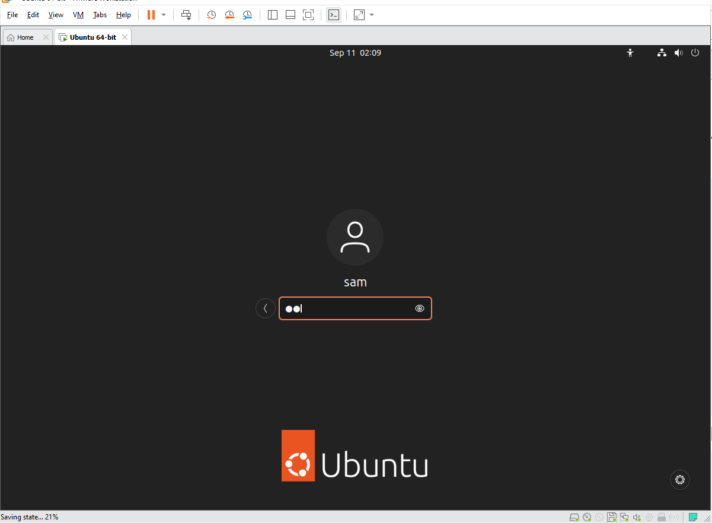

# Assignment W2.4: Local Virtual Machine Setup

## Step 1: Installing the terminal on windows 11
Since I am running windows 11, I needed a proper Linux-like terminal environment to manage everything. I chose to install **Git Bash** because it is lightweight and provides a clean bash environment. I downloaded the official installer, ran through the setup wizard keeping the default settings.

## Step 2: Choosing and installing the Hypervisor
For my hypervisor, I selected **VMware Workstation 17.6 Player**. I chose VMware because it handles resource allocation incredibly well on Windows 11 and tends to have great performance and driver support out of the box compared to other options. I downloaded the executable from broadcom/VMware, ran the installer, and rebooted my machine to ensure all virtual network adapters were correctly configured.

## Step 3: Creating and launching the VM
I downloaded the **Ubuntu 22.04 LTS** desktop ISO image to use as my guest operating system. Inside VMware, I walked through the following configuration steps:
1. Clicked **Create a New Virtual Machine**.
2. Selected the downloaded Ubuntu 22.04 ISO file.
3. Named the VM "Ubuntu 22.04" and set up my default username and password.
4. Allocated 40 GB of virtual hard disk space (split into multiple files for easier management).
5. Configured the hardware to use 4 CPU cores and 8 GB of RAM to keep performance smooth.
6. Hit finish, launched the VM, and let the automated Ubuntu installer finish setting up the OS.

## Step 4: Verification and proof of login
Once the installation finished and the system rebooted, I logged into my user account and opened up the native Linux terminal inside Ubuntu. 

To prove the machine is up, running, and accessible, here is a screenshot:

*(Note: The above screenshot is saved in the local directory at `/assignments/week1/vm-login.png`).*
